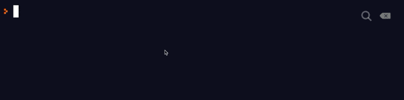

# 2008-FSA-RM-BCPWK-B

Hello! This is where I will put all the material for BCP. If any of the links don't work don't hesitate to slack us and let us know.

## Table of Contents

1. [Introduction And Tidy Code](#01-introduction-and-tidy-code)
2. [Loops And Debugging](#02-loops-and-debugging)
3. [Coercion And Truthiness](#03-coercion-and-truthiness)
4. [Scope](#04-scope)
5. [Arrays I](#05-arrays-I)

## Additional Resources

- [Repl.it](https://repl.it/repls) Play around with code!
- [Code Visualizer](http://www.pythontutor.com/visualize.html#mode=edit) Visualize your code step by step
- [Code Wars - Loops](https://www.codewars.com/kata/search/javascript?q=&r%5B%5D=-8&r%5B%5D=-7&tags=Loops) Practice more loops
- [practice](https://www.codewars.com/users/MrZizoScream/authored)

## Code War Links:

> Here are a few links to problems on code wars, feel free to start at whatever level you feel confident. They're an excellent way to review things we've learned thus far.

> 8 = Beginner, 1 = Master

- [Loops 8 kyu](https://www.codewars.com/kata/search/my-languages?beta=false&q=&r=-8&tags=Loops)
- [Loops 7 kyu](https://www.codewars.com/kata/search/my-languages?q=&r%5B%5D=-7&tags=Loops&beta=false)
- [Control Flow(if and else) 8 kyu](https://www.codewars.com/kata/search/my-languages?beta=false&q=&r=-8&tags=Control+Flow)
- [Control Flow 7 kyu](https://www.codewars.com/kata/search/my-languages?q=&r%5B%5D=-7&tags=Control+Flow&beta=false)

## **00 Additional Notes**

### Notes

[Full Notes](00-additional-notes)

1. [Functions](00-additional-notes/01-functions.js)
2. [Const vs Lets](00-additional-notes/02-const-vs-let.js)
3. [Quick Maths](00-additional-notes/03-quick-maths.js)
4. [String Interpolation](00-additional-notes/04-string-interpolation.js)

## **01 Introduction and Tidy Code**

[Workshop](https://learn.fullstackacademy.com/workshop/5ab7da028b8e9b000477fd36/content/5ab7dbafa468c900045db6ed/text)

[Solutions](https://learn.fullstackacademy.com/workshop/5ab7da028b8e9b000477fd36/content/5ab7dc11a468c900045db703/text)

[Lecture Slides](00-slides/01-Introduction-and-Tidy-Code.pdf)

### Notes

[Full Notes](01-tidy-code)

1. [Indenting](01-tidy-code/01-indenting.js)
2. [Variable Names](01-tidy-code/02-variable-names.js)

## **02 Loops And Debugging**

**[Prerecorded Lecture](https://learn.fullstackacademy.com/workshop/5ac57192f7ff470004a63148/content/5ac571d2bd9f9e0004adb0a4/text)**

[Lecture Slides](00-slides/02-Loops-and-Debugging.pdf)

**[Live Lecture](https://youtu.be/dNAe7_5fyIs)**

[Workshop](https://learn.fullstackacademy.com/workshop/5ac57192f7ff470004a63148/content/5ac572977ec3340004bddd57/text)

[Solutions](https://learn.fullstackacademy.com/workshop/5ac57192f7ff470004a63148/content/5ac57384f7ff470004a63170/text)

### Notes

[Full Notes](02-loops-and-debugging)

1. [While Loop](02-loops-and-debugging/01-while-loop.js)
2. [For Loop](02-loops-and-debugging/02-for-loop.js)
3. [Which is Better](02-loops-and-debugging/03-which-is-better.js)
4. [Continue Keyword](02-loops-and-debugging/04-continue-keyword.js)
5. [Break Keyword](02-loops-and-debugging/04-break-keyword.js)

## **03 Coercion and Truthiness**

[Lecture Slides](00-slides/03-Coercion-and-Truthiness.pdf)

**[Live Lecture](https://youtu.be/IXqOk8kFCdE)**

[Workshop](https://learn.fullstackacademy.com/workshop/5ac574e51abd3200043c12e8/content/5ac574e51abd3200043c12ed/text)

[Solutions](https://learn.fullstackacademy.com/workshop/5ac574e51abd3200043c12e8/content/5ac574e51abd3200043c12ee/text)

### Notes 
[Full Notes](03-coercion-and-truthiness)

1. [Explicit Coercion](03-coercion-and-truthiness/01-explicit-coercion.js)
2. [Implicit Coercion](03-coercion-and-truthiness/02-implicit-coercion.js)
3. [Implicit Coercion II](03-coercion-and-truthiness/03-implicit-coercion-II.js)
4. [Conditionals](03-coercion-and-truthiness/04-conditionals.js)
5. [Not Operator](03-coercion-and-truthiness/05-not-operator.js)
6. [And](03-coercion-and-truthiness/06-and.js)
7. [Or](03-coercion-and-truthiness/07-or.js)

## **04 Scope**

**[Live Lecture](https://youtu.be/ziVfJDR9ZK0)**

[Workshop](https://learn.fullstackacademy.com/workshop/5ac576417ec3340004bdddb4/content/5ac576417ec3340004bdddb9/text)

[Solutions](https://learn.fullstackacademy.com/workshop/5ac576417ec3340004bdddb4/content/5ac576417ec3340004bdddba/text)

### Notes

[Full Notes](04-scope)

1. [Global Scope](04-scope/01-global-scope.js)
2. [Global Scope II](04-scope/02-global-scope-ii.js)
3. [Functional Scope](04-scope/03-functional-scope.js)
4. [Functional Scope II](04-scope/04-functional-scope-ii.js)
5. [Functions and Parameters](04-scope/05-functions-and-parameters.js)
6. [Nested Functions](04-scope/06-nested-functions.js)
7. [Nested Functions II](04-scope/07-nested-functions-ii.js)
8. [Block Scope](04-scope/08-block-scope.js)
9. [Scope Best Practices](04-scope/09-scope-best-practices.js)

## **05 Arrays I**

**[Live Lecture](https://youtu.be/Qqdh0Gs0e7k)**

[Workshop](https://learn.fullstackacademy.com/workshop/5ac57806bd9f9e0004adb186/content/5ac57806bd9f9e0004adb18b/text)

[Solutions](https://learn.fullstackacademy.com/workshop/5ac57806bd9f9e0004adb186/content/5ac57806bd9f9e0004adb18c/text)

### Notes 
[Full Notes](05-arrays-i)

1. [What is an Array](05-array-i/01-what-is-an-array.js)
2. [Array Access + Assignment](05-array-i/02-array-accessing.js)
3. [Push + Pop](05-array-i/03-push-pop.js)
4. [Shift + Unshift](05-array-i/04-shift-unshift.js)
5. [More methods](05-array-i/05-more-methods.js)
6. [Slice + Reverse](05-array-i/06-slice.js)
7. [Splice Sneak Peak](/05-arrays-i/07-splice-sneak-peak.js)
